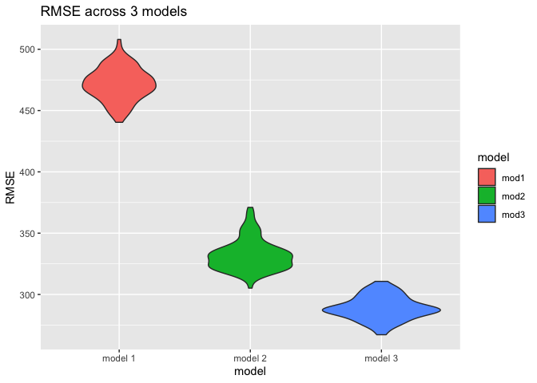
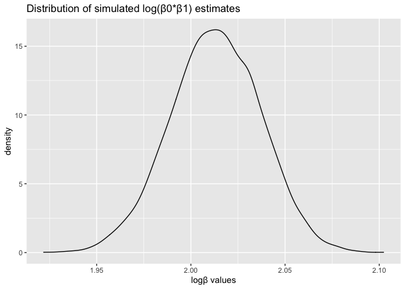

Homework 6
================
Lydia Parr
2021-12-04

Loading in needed packages:

``` r
library(tidyverse)
library(modelr)
```

## Problem 1

To start, I will load and clean the data for regression analysis,
including converting numeric to factor where appropriate and checking
for missing data:

``` r
birthweight = 
  read_csv("./data/birthweight.csv") %>%
  janitor::clean_names() %>%
  mutate(
    babysex = as.factor(babysex),
    frace = as.factor(frace),
    mrace = as.factor(mrace),
    malform = as.factor(malform)
  ) 

sum(is.na(birthweight))
```

    ## [1] 0

There are no missing values.

The variables in the data set are babysex, bhead, blength, bwt, delwt,
fincome, frace, gaweeks, malform, menarche, mheight, momage, mrace,
parity, pnumlbw, pnumsga, ppbmi, ppwt, smoken, wtgain.

The literature on low birthweight babies indicates social factors and
health-related predictors like maternal age, fetal health issues, and
previous low birthweight babies contribute to infant birthweight. I will
include family income, maternal race, maternal age at delivery, presence
of malformations, and previous low birth weight babies, and maternal
weight gain during pregnancy as predictors of low birthweight (Moreira,
de Sousa, & Flavio Sarnom, 2018; Reichman & Pagnini,1997).

Moreira, A., Sousa, P., & Sarno, F. (2018). Low birth weight and its
associated factors. *Einstein (Sao Paulo, Brazil), 16*(4), eAO4251.
<https://doi.org/10.31744/einstein_journal/2018AO4251>

Reichman, N. E., & Pagnini, D. L. (1997). Maternal age and birth
outcomes: data from New Jersey. *Family planning perspectives, 29*8(6),
268–295.

My model: E(bwt) = malform + mrace + pnumlbw + wtgain + momage + fincome

Next I will fit my model, then check residuals for regression
diagnostics by creating a plot of model residuals against fitted values
with `add_predictions` and `add_residuals`:

``` r
model_1 = lm(bwt ~ malform + mrace + pnumlbw + wtgain + momage + fincome, data = birthweight)

model_1 %>% broom::tidy() %>%
  select(p.value, term, estimate)
```

    ## # A tibble: 9 x 3
    ##     p.value term        estimate
    ##       <dbl> <chr>          <dbl>
    ## 1  0        (Intercept) 2807.   
    ## 2  3.23e- 1 malform1    -121.   
    ## 3  2.34e-60 mrace2      -278.   
    ## 4  6.14e- 2 mrace3      -137.   
    ## 5  2.78e- 7 mrace4      -167.   
    ## 6 NA        pnumlbw       NA    
    ## 7  6.07e-68 wtgain        11.7  
    ## 8  2.68e- 4 momage         7.45 
    ## 9  1.95e- 2 fincome        0.720

``` r
birthweight  %>%
  modelr::add_predictions(model_1, var = "prediction")  %>%
  modelr::add_residuals(model_1, var = "residual")  %>%
  ggplot(aes(x = prediction, y = residual)) +
  geom_point(alpha = 0.2) +
  geom_smooth(se = FALSE, method = "lm", color = "red") +
  labs(
    x = "predicted values",
    y = "residuals",
    title = "Residuals and predicted values for model 1"
  )
```

<!-- -->

The residuals look evenly distributed around 0, so this model is
appropriate to use based on this graph.

Now, I will compare this model to two others:

-   One using length at birth and gestational age as predictors (main
    effects only) -One using head circumference, length, sex, and all
    interactions (including the three-way interaction) between these

I will do so using cross-validated prediction error and plot RMSE for
the three models:

``` r
crossvalidation = 
  crossv_mc(birthweight, 100) %>%
  mutate(
    test = map(test, as_tibble), 
    train = map(train, as_tibble)
  )
crossvalidation = crossvalidation %>%
    mutate(
      mod1 = map(train, ~lm(bwt ~ malform + mrace + pnumlbw + wtgain + momage + 
                            fincome, data = .x)), 
      mod2 = map(train, ~lm(bwt ~ blength + gaweeks, data = .x)),
      mod3 = map(train, ~lm(bwt ~ bhead + blength + babysex + babysex*blength + 
                            babysex*bhead + blength*bhead + babysex*blength*bhead, 
                            data = .x))
  ) %>%
  mutate(
    rmse_mod1 = map2_dbl(mod1, test, ~rmse(model = .x, data = .y)),
    rmse_mod2 = map2_dbl(mod2, test, ~rmse(model = .x, data = .y)),
    rmse_mod3 = map2_dbl(mod3, test, ~rmse(model = .x, data = .y)),
  )
  

crossvalidation %>% 
  select(starts_with("rmse")) %>% 
  pivot_longer(
    everything(),
    names_to = "model", 
    values_to = "rmse",
    names_prefix = "rmse_") %>% 
  mutate(model = fct_inorder(model)) %>% 
  ggplot(aes(x = model, y = rmse)) +
  geom_violin(aes(fill = model)) +
  scale_x_discrete(labels = c("mod1" = "model 1",
                              "mod2" = "model 2",
                              "mod3" = "model 3")) +
  labs(
    x = "model",
    y = "RMSE",
    title = "RMSE across 3 models"
  )
```

<!-- -->

Based on the plot of the RMSE for the three models, model 3 is the best
model, as it has the lowest RMSE value. This means the most optimal
model to examine predictors of low birthweight is the one using using
head circumference, length, sex, and all interactions (including the
three-way interaction).

## Problem 2

This section involves a simple linear regression with tmax as the
response and tmin as the predictor, looking at the distribution of two
quantities estimated from these data, R^2 and estimated log(β0\*β1).

First, I load in the data:

``` r
weather_df = 
  rnoaa::meteo_pull_monitors(
    c("USW00094728"),
    var = c("PRCP", "TMIN", "TMAX"), 
    date_min = "2017-01-01",
    date_max = "2017-12-31") %>%
  mutate(
    name = recode(id, USW00094728 = "CentralPark_NY"),
    tmin = tmin / 10,
    tmax = tmax / 10) %>%
  select(name, id, everything())
```

I begin the process by bootstrapping:

``` r
set.seed(1)

boot_sample = function(df) {
  sample_frac(df, replace = TRUE)
}

boot_data = 
  data_frame(
    strap_number = 1:5000, 
    strap_sample = rerun(5000, boot_sample(weather_df))
  )
```

Next I look at R^2, plotting the distribution:

``` r
boot_1 = 
  boot_data  %>%
  mutate(
    models = map(strap_sample, ~lm(tmax ~ tmin, data = .x)),
    results = map(models, broom::glance)
  ) %>%
  select(-strap_sample, -models) %>%
  unnest(results)

boot_1 %>%
  janitor::clean_names() %>%
  summarize(
    lower_limit = quantile(r_squared, c(.025)),
    upper_limit = quantile(r_squared, c(.975)),
  ) %>%
  knitr::kable()
```

| lower\_limit | upper\_limit |
|-------------:|-------------:|
|    0.8936684 |     0.927106 |

``` r
boot_1 %>%
  ggplot(aes(x = r.squared)) +
  geom_density() +
  labs(
    x = "r**2 values",
    y = "density",
    title = "Distribution of simulated r**2 estimates"
  )
```

<!-- -->

The distribution of estimated R^2 values looks approximately normal, and
the 95% CI for R^2 is (0.8936684, 0.927106)

I then repeat the process with log(β0\*β1 ) estimates, using a function
for the beta estimates and broom::tidy

``` r
log_beta_h = function(df) {
  log(df[1,2]*df[2,2]) %>%
    tibble() %>%
    mutate(
      log_beta = .$estimate) %>%
    select(log_beta)
}

boot_2 = 
  boot_data  %>%
  mutate(
    models = map(strap_sample, ~lm(tmax ~ tmin, data = .x)),
    results = map(models, broom::tidy),
    log_beta = map(results, log_beta_h)) %>%
  select(-strap_sample, -models) %>%
  unnest(log_beta)

boot_2 %>%
  janitor::clean_names() %>%
  summarize(
    lower_limit = quantile(log_beta, c(.025)),
    upper_limit = quantile(log_beta, c(.975)),
  ) %>%
  knitr::kable()
```

| lower\_limit | upper\_limit |
|-------------:|-------------:|
|     1.964949 |     2.058887 |

``` r
boot_2 %>%
  ggplot(aes(x = log_beta)) +
  geom_density() +
  labs(
    x = "logβ values",
    y = "density",
    title = "Distribution of simulated log(β0*β1) estimates"
  )
```

<!-- -->

The distribution of estimated log(β0\*β1) appears normal, and the 95% CI
is (1.9649487, 2.0588875)
